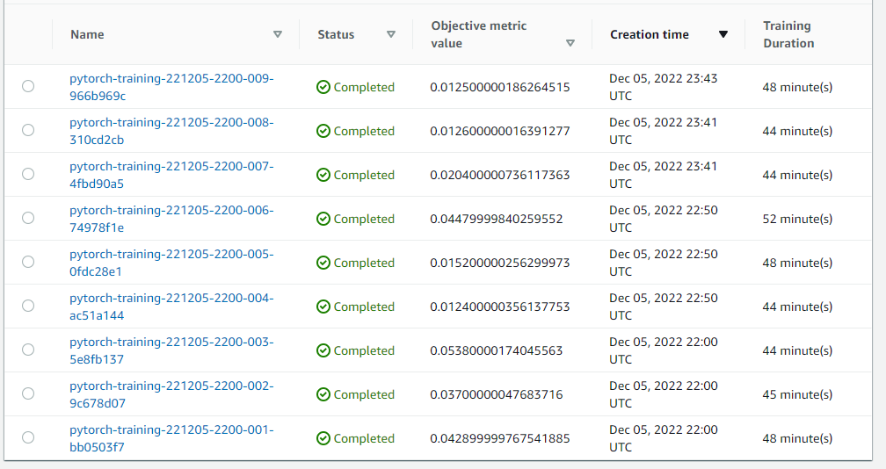
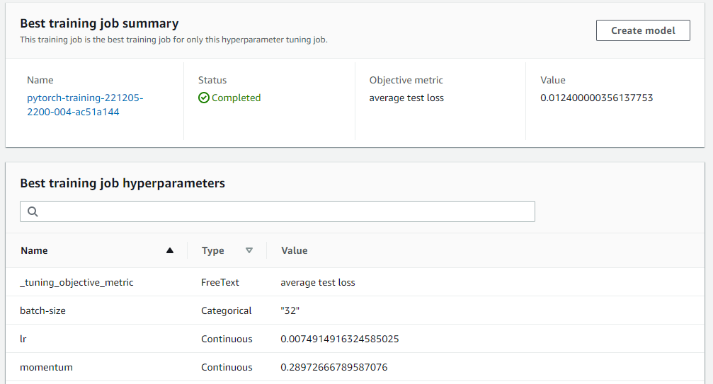
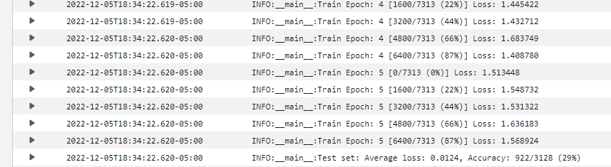
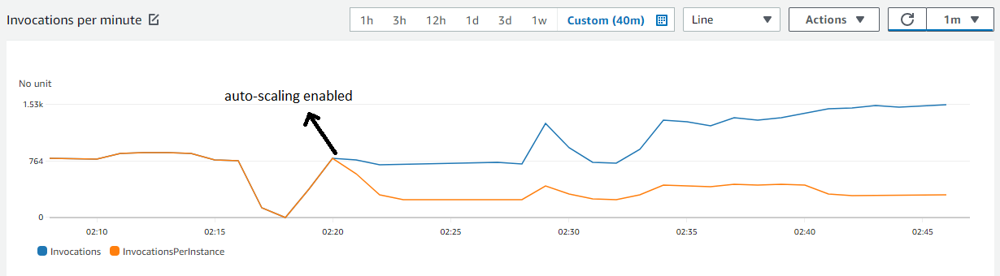

# Capstone Project Proposal - Inventory Monitoring at Distribution Centers

Distribution centers have a lot of repetitive processes in their daily operation, nowadays, a lot of these processes have been automated with AI and robotics. A lot of operations using robotics need to feed the robot’s logic with information about its surroundings, it can be done using computer vision algorithms such as Convolutional Neural Networks (CNN). This project is about a computer vision solution to help robots successfully achieve their daily tasks.

Robots in a distribution center need to move bins with items from one place to another, for example, robots move items to set up the inventory in warehouses. Usually, these moving operations are achieved using bins, the robot needs to know how many items each bin has to keep count of the number of items moved. It is difficult to equip a moving robot with the necessary technology to make this counting process accurate and affordable, but, considering that we live in the technology revolution, another solution can be to use an external system that does this counting job, maybe with an image of the bins’ content.

The most feasible solution to this problem is to equip the robot with a camera that focuses on the bins’ content and sends the image to a system that does the job. This outsourced system has to be equipped with the necessary AI to identify how many items a bin has by using only an image of the bin’s content. This AI will be CNN which needs to be trained with hundreds or even thousands of labeled images. In this project, we want to train and deploy a model for helping the robots within a distribution center to identify how many items are in a bin’s photo.

## Dataset

### Overview
The dataset for developing this project is the [Amazon Bin Image Dataset](https://registry.opendata.aws/amazon-bin-imagery/) which contains 500.000 images of bins containing one or more products, it also has a metadata file for each image which contains information about the number of objects in the bin, their dimensions, and type. We need to work with a subset of this dataset to prevent any excess in SageMaker credit usage.

### Access
I downloaded the dataset from the S3 bucket that AWS provided to us, I did this process using the function download_and_arrange_data() which was provided within the starter code of this project. This function downloads a sample of the data and then organize it within folders (1,2,3,4,5) indicating the numbers of objects for each image. Then, I divided the data in train and test sets. After this step, I uploaded the data to my S3 bucket using the AWS cli.

## Model Training
I used a ResNet18 pretrained model to get advantage of the previously learned features, I add to the end of the NN a fully connected layer with 5 output neurons to used them as predictors for my 5 classes. I executed an hyperparameter tuning job to find best *Learning rate*, *momentum*, and *batch-size*. As a result, I got a model with 29% accuracy. In the following screenshots we can see the executed hyperparameter tuning job, the best job's hyperparameters, and the accuracy for the test data in the best model.

## Machine Learning Pipeline
The project Pipeline I have implemented can be resumed in the following steps:
1. Data preprocessing
    1. Data sampling and downloading
    2. Data splitting (train and test)
    3. Data uploading to S3
2. Training
    1. Writing training script (train.py)
    2. Hyperparameter tunning
3. Deploying
    1. Selecting best model and deploy it
    2. Running multiple predictions to stress the endpoint
    3. Calibrating endpoint's autoscaling capabilities

## Standout Suggestions
I did a few tests to stress the endpoint with a lot of predictions, these tests were made using the first cell in the section "Running multiple predictions to stress the endpoint" and using the Jupyter Notebook "more-predictions.ipynb" from another SageMaker instance. In the following images we can see how the capabilities to respond multiple invocantions start to grow when auto-scaling is enabled. A single enpoint was able to process about 770 invocations per minute before the auto-scaling was activated, after this, the endpoint was able to process about 1,500 invocations per minute, and we can see that the stress for individual instances was dramatically reduced, this kind calibration could reduce endpoint's latency and improve the solution throughput. 

